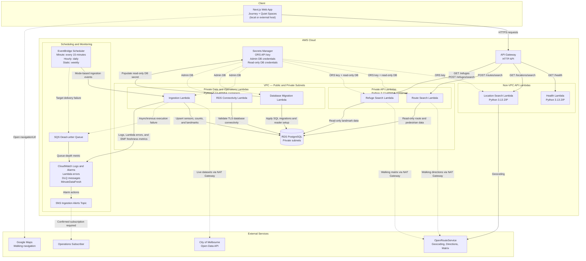

# TA15 Onboarding Project

Industry Experience Studio (FIT5120)

## Tech Stack

### Frontend

- Next.js
- React
- TypeScript
- Tailwind CSS
- pnpm

### Backend

- AWS Lambda (Python 3.13)

### Infrastructure

- Terraform
- AWS API Gateway
- AWS IAM

### Database (Upcoming)

- PostgreSQL (Amazon RDS)

---

# Project Structure

```text
project-root/
├── apps/
│   └── web/                # Next.js frontend
│
├── services/
│   └── api/                # Python Lambda functions
│
├── packages/
│   └── database/           # SQL schema and migrations
│
├── infra/
│   └── aws/                # Terraform
│
└── docs/
```

---

# System Architecture

The following diagram illustrates the end-to-end system architecture of ClearWay, spanning the frontend, backend APIs, data ingestion pipeline, database storage, and ops/monitoring components.



### Component Overview

- **Frontend Client**: A Next.js/React web application styled with Tailwind CSS, running on Vercel (production) or local node development environments. It interacts with the backend services via a configured `NEXT_PUBLIC_API_BASE_URL` pointing to the API Gateway.
- **API Gateway & Routing**: An AWS HTTP API Gateway configured with CORS (allowing authorized frontend origins) that acts as the single entry gateway, routing API requests to target Lambda functions.
- **Lambda Services (VPC Private Subnet)**: Containerized Python 3.13 functions deployed on ARM64 architectures:
  - **Health API** (`/health`): Verifies service health.
  - **Location Search API** (`/locations/search`): Queries database for sensor locations.
  - **Refuge Search API** (`/refuges` & `/refuges/search`): Returns landmarks (e.g. parks, gardens) tagged with `is_refuge = true`.
  - **Route Search API** (`/routes/search`): Conducts route safety/comfort scoring using pedestrian flow data.
  - **RDS Connectivity**: Utility function verifying private database endpoint connectivity.
  - **Database Migration**: Executes SQL schemas and runs Knex/custom migration scripts to sync schema.sql against RDS.
- **Data Ingestion Pipeline**: EventBridge schedules trigger the Ingestion Lambda with different modes:
  - **Minute-level Ingestion**: Every 15 minutes to sync current pedestrian conditions.
  - **Hourly Ingestion**: Run daily (cron `15 2 * * ? *`) to backfill the previous day's historical counts.
  - **Static Metadata Ingestion**: Run weekly (cron `30 3 ? * SUN *`) to fetch the list of pedestrian sensors and landmarks.
- **Database Storage**: Amazon RDS PostgreSQL instance hosted securely in private subnets, restricting inbound traffic exclusively to Lambdas via AWS security groups.
- **Monitoring & Alerting**: System events and ingestion status are monitored via CloudWatch metric alarms (freshness, errors, DLQ size). Lambda execution failures or EventBridge failures are captured into an SQS Dead-Letter Queue (DLQ), triggering alerts through an SNS topic.

---

# Prerequisites

Install the following tools before starting.

| Tool       | Version |
| ---------- | ------- |
| Node.js    | 22.x    |
| pnpm       | Latest  |
| Python     | 3.13    |
| Terraform  | >= 1.9  |
| AWS CLI v2 | Latest  |
| Git        | Latest  |

Verify installation

```bash
node -v
pnpm -v
python3 --version
terraform version
aws --version
```

---

# Node.js Setup

Use Node.js 22.

```bash
nvm use 22
```

If Node.js 22 is not installed:

```bash
nvm install 22
nvm use 22
```

If `nvm` is not installed, follow this [guide](https://www.freecodecamp.org/news/node-version-manager-nvm-install-guide/)

---

# pnpm Setup

Enable Corepack.

```bash
corepack enable
```

Install workspace dependencies.

```bash
pnpm install
```

---

# Run Frontend

From the project root:

```bash
pnpm dev
```

Open

```
http://localhost:3000
```

---

# AWS Setup

## 0. Create AWS Account

1. Go to this [AWS Console link](https://aws.amazon.com/console/)
2. Click **Create account** on the top right
3. Use student email to register for Root user email
4. Once register successfully, set up an Alias
   1. Go to the **IAM Dashboard** in the AWS console.
   2. Find **Account Alias** under the AWS Account box (on the right of screen).
   3. Click **Create** (or **Edit** if changing).
   4. Type a unique, lowercase name for your account.
   5. Click **Save changes**.

## 1. Create IAM User

On IAM dashboard, click **IAM Users** on the left side and create user
**Note:** leave **Provide user access to the AWS Management Console - optional** uncheck

Next, select **Attach policies directly** and search permission policy below

```
AdministratorAccess
```

Generate an Access Key for CLI usage. (Save csv file)

---

## 2. Configure AWS CLI

```bash
aws configure --profile ta15-dev
```

Example

```
AWS Access Key ID: <from csv file>
AWS Secret Access Key: <from csv file>
Region: ap-southeast-4
Output: json
```

---

## 3. Export Profile

macOS/Linux

```bash
export AWS_PROFILE=ta15-dev
```

Windows PowerShell

```powershell
$env:AWS_PROFILE="ta15-dev"
```

---

## 4. Verify Credentials

```bash
aws sts get-caller-identity
```

Expected output

```json
{
  "Account": "...",
  "Arn": "...",
  "UserId": "..."
}
```

---

# Terraform Setup

If `Terraform` is not installed, follow this [guide](https://developer.hashicorp.com/terraform/install)

Move into the Terraform directory.

```bash
cd infra/aws
```

Copy the example variables.

```bash
cp terraform.tfvars.example terraform.tfvars
```

Initialize Terraform.

```bash
terraform init
```

Validate configuration.

```bash
terraform validate
```

Preview resources.

```bash
terraform plan
```

Deploy infrastructure.

```bash
terraform apply
```
Note: Enter `yes` if prompted

---

# Verify Deployment

Retrieve the Health API endpoint.

```bash
terraform output -raw health_endpoint
```

Example

```
https://xxxxx.execute-api.ap-southeast-4.amazonaws.com/health
```

Test it.

```bash
curl $(terraform output -raw health_endpoint)
```

Expected response

```json
{
  "status": "ok"
}
```

---

---

# Data Pipeline Setup
 
The pipeline (`services/api/src/pipeline/`) loads Melbourne's open pedestrian sensor, landmark, and refuge data into PostgreSQL. The app has nothing to query until this has run at least once. Requires a local Postgres instance and a couple of data files.
 
**What it does, in order:**
 
```
build_schema.py           →  creates the 6 empty tables
ingest_sensor_locations.py →  sensor metadata (must run before either count table -- they FK to it)
ingest_pedestrian_minute.py → near-real-time minute-by-minute counts (current conditions)
ingest_pedestrian_hourly.py → historical hourly counts (used to work out each sensor's "busy" threshold)
ingest_landmarks.py        →  parks/gardens etc., tagged as sensory "refuges"
```
 
Each script can be run on its own, or all at once with:
 
```bash
cd services/api/src/pipeline
python3 run_pipeline.py --reset
```
 
## 1. Local Postgres
 
```bash
brew install postgresql@16
brew services start postgresql@16
psql postgres -c "CREATE USER clearway WITH PASSWORD 'clearway_dev' CREATEDB;"
psql postgres -c "CREATE DATABASE clearway OWNER clearway;"
cd services/api/src/pipeline
python3 build_schema.py --reset
```
 
## 2. Sensor locations
 
Already committed to the repo at `services/api/src/pipeline/data/pedestrian-counting-system-sensor-locations.csv` (source: [Melbourne Open Data Portal](https://data.melbourne.vic.gov.au/explore/dataset/pedestrian-counting-system-sensor-locations/), CC BY 3.0 AU). No download needed — just run:
 
```bash
python3 ingest_sensor_locations.py
```
 
This loads each sensor's name, status (active/decommissioned), and coordinates. Run this **before** either count script below — they reference `location_id` as a foreign key, so a count row for a sensor Postgres doesn't know about yet will be rejected.
 
## 3. Minute counts
 
Near-real-time pedestrian counts, used to work out how busy a sensor is *right now*. Use the live API — no download needed:
 
```bash
python3 -c "from ingest_pedestrian_minute import load; load(source='api')"
```
 
A CSV-based backfill path also exists (`load(source='csv')`) for testing against historical data — see `MINUTE_COUNTS_CSV` in `config.py` for the expected file path if needed.
 
**Gap handling:** if an active sensor has no reading for a given minute, that's treated as "no reading = zero pedestrians" — the script fills it in with a `0` and flags the row `is_imputed = true`, rather than leaving a hole.
 
## 4. Hourly counts
 
Historical hourly counts, used to work out each sensor's normal "busy" threshold (currently: top 25% of its own past hourly counts). Large file (~1.6M rows), no live equivalent, so it must be downloaded manually if you're working on `ingest_pedestrian_hourly.py`:
 
1. Download the CSV from [here](https://data.melbourne.vic.gov.au/explore/dataset/pedestrian-counting-system-monthly-counts-per-hour/export/)
2. Place it at `services/api/src/pipeline/data/pedestrian-counting-system-monthly-counts-per-hour.csv`
**Note:** always use the portal's CSV export (`/export/` page), not data pulled via the live API — the two use different column naming conventions (`Location_ID` vs `location_id`), and the ingest scripts expect the CSV export's format.
 
**Gap handling:** unlike minute counts, a missing (sensor, hour) here is treated as "sensor was offline", not "zero pedestrians" — the script does **not** fabricate rows for it. Sensor-days with fewer than 24 hourly readings are just logged as a data-quality note.
 
**Timestamps:** the CSV's date + hour columns are combined into a proper Melbourne local timestamp (`Australia/Melbourne`), correctly accounting for daylight saving (AEST `+10:00` in winter vs AEDT `+11:00` in summer) rather than a fixed offset — this keeps hourly timestamps aligned with the minute-count data, which uses the same timezone-aware approach.
 
**Unknown sensors:** if the file references a `location_id` not present in `sensor_location` (e.g. a decommissioned sensor), the script inserts a minimal stub row for it (`status = 'D'`) so the historical data can still be loaded without breaking the foreign key.
 
## 5. Landmarks and refuges
 
Parks, gardens, and other places of interest, used to identify nearby sensory "refuges". Already committed to the repo at `services/api/src/pipeline/data/landmarks-and-places-of-interest-including-schools-theatres-health-services-spor.csv` (source: [Melbourne Open Data Portal](https://data.melbourne.vic.gov.au/explore/dataset/landmarks-and-places-of-interest-including-schools-theatres-health-services-spor/)). No download needed — just run:
 
```bash
python3 ingest_landmarks.py
```
 
Each landmark is grouped by Theme/Sub-Theme, and only categories listed in `config.REFUGE_THEME_SUBTHEME_PAIRS` (currently just parks/gardens) are flagged `is_refuge = true`. Downstream queries filter on that flag rather than re-checking the theme every time.
 
---

# Environment Variables

Frontend

Create

```
apps/web/.env.local
```

Example

```env
NEXT_PUBLIC_API_BASE_URL=https://<api-gateway-url>
```

---

# Git Ignore

The following files must **never** be committed.

```
node_modules/
.next/

.env*
!.env.example

.terraform/
terraform.tfstate
terraform.tfstate.*

terraform.tfvars

.terraform-build/

.venv/
```

---

# Useful Commands

Run frontend

```bash
pnpm dev
```

Terraform plan

```bash
terraform plan
```

Terraform apply

```bash
terraform apply
```

Destroy infrastructure

```bash
terraform destroy
```

Terraform formatting

```bash
terraform fmt -recursive
```

